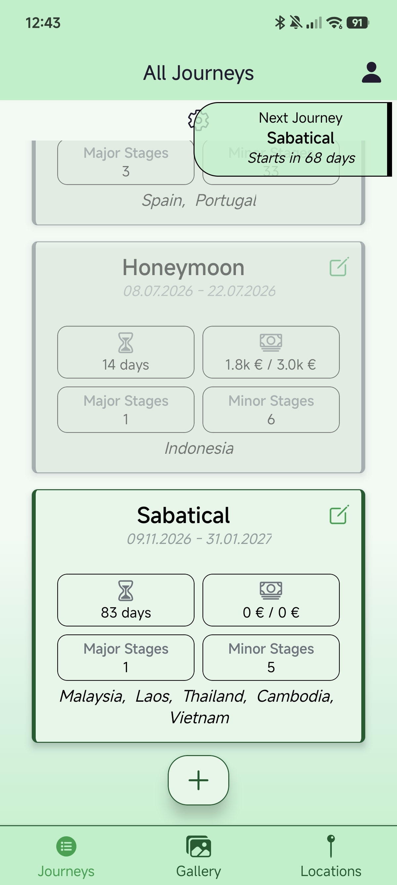
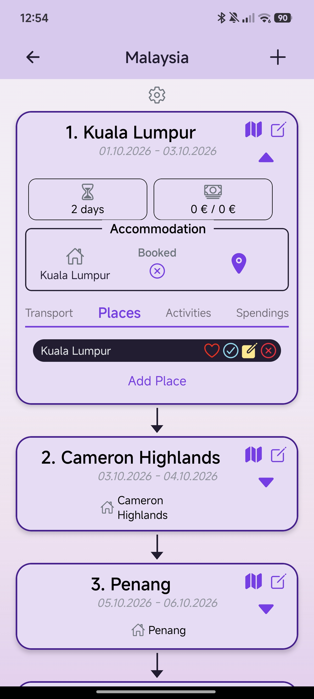
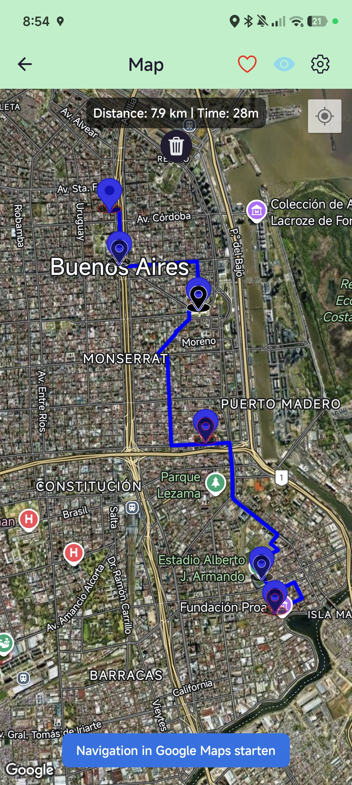
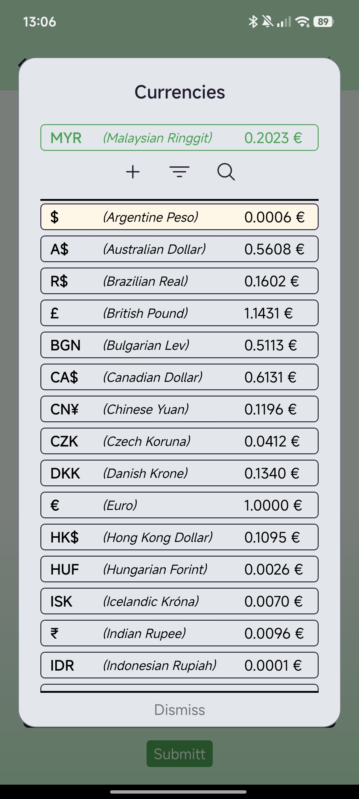
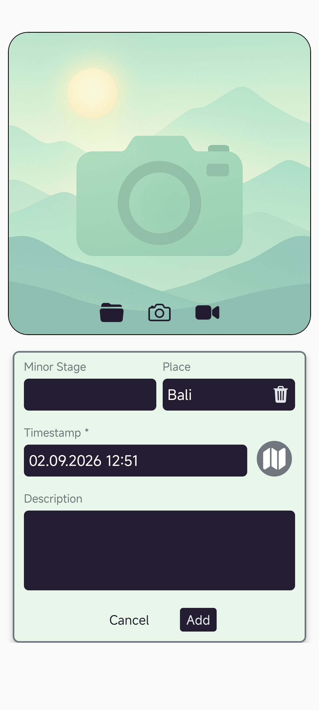
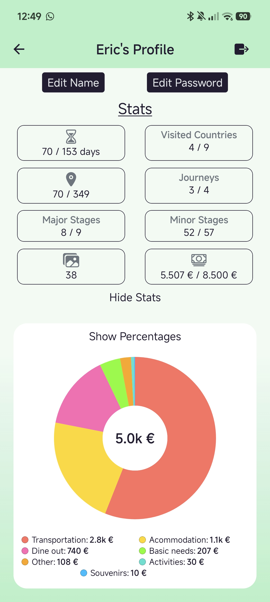
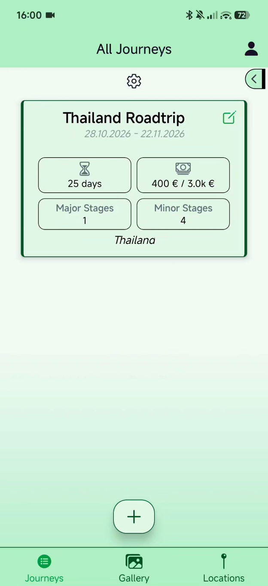
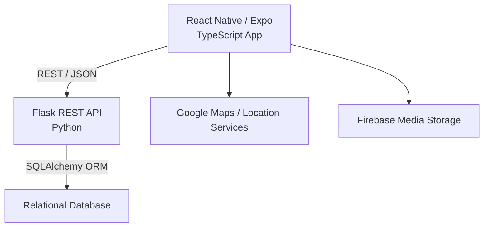
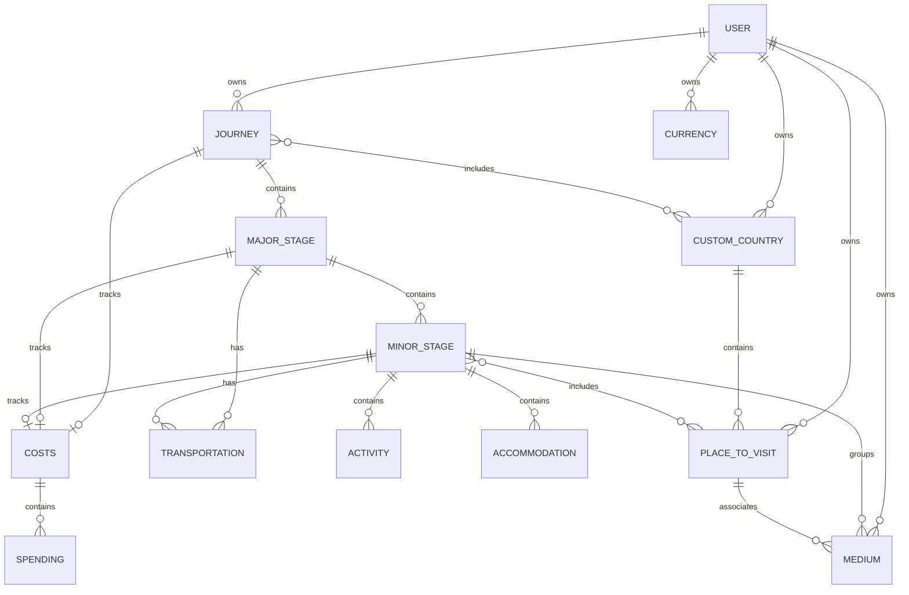

# TravelBuddy

**A full-stack mobile application for planning and managing complex multi-stage journeys.**

TravelBuddy brings itinerary planning, destinations, transportation, accommodation, activities, expenses, currencies and travel media into a single mobile workflow.

The application is built as an end-to-end full-stack project with a **React Native / Expo frontend** and a **Python / Flask backend** using SQLAlchemy and a relational data model. It integrates map and location services, Firebase-based media storage and JWT authentication.

The project focuses not only on the user-facing travel experience, but also on backend architecture, relational data modeling, resource-level authorization, automated testing and continuous integration.

---

## Screenshots

<p align="center">
  
  
  
</p>

<p align="center">
  
  
  
</p>

---

## Demo

See TravelBuddy in action:

[](docs/videos/demo_compressed.mp4)

---

## Key Features

- **Hierarchical journey planning**  
  Structure complex trips into journeys, major stages and detailed minor stages.

- **Map-based route planning**  
  Visualize destinations and routes using integrated map and location services.

- **Places & destination management**  
  Save points of interest, organize them by country and associate them with individual travel stages.

- **Transportation planning**  
  Manage transportation at both major-stage and minor-stage level, including departure and arrival information.

- **Activities & accommodation**  
  Plan activities and accommodation together with dates, locations, booking information and costs.

- **Hierarchical expense tracking**  
  Track budgets and individual spendings at journey, major-stage and minor-stage level.

- **Travel media management**  
  Store and organize photos and videos and associate media with travel stages or saved places.

- **Currency management**  
  Maintain travel currencies and conversion rates for multi-country journeys.

- **Secure user-specific data**  
  JWT authentication and resource-level authorization ensure that users can only access and modify their own data.

- **Mobile-first workflow**  
  Built with React Native and Expo for an integrated mobile travel-planning experience.

---

## Architecture

TravelBuddy uses a separated mobile-client / REST-API architecture:



The mobile client and backend API are maintained as separate repositories, allowing both parts of the application to evolve independently.

**Backend Repository:**  
[TravelBuddy Backend](https://github.com/Meilocora/TravelBuddy-backend)

---

## Tech Stack

| Area                  | Technologies                                     |
| --------------------- | ------------------------------------------------ |
| **Mobile**            | React Native, Expo, TypeScript, React Navigation |
| **Maps & Location**   | Google Maps / location services                  |
| **Media**             | Expo Camera, Image Picker, Firebase Storage      |
| **Backend**           | Python, Flask, SQLAlchemy, REST / JSON           |
| **Authentication**    | JWT access & refresh tokens                      |
| **Database**          | Relational data model via SQLAlchemy             |
| **Testing**           | pytest, pytest-cov                               |
| **Code Quality & CI** | Ruff, GitHub Actions                             |
| **Version Control**   | Git, GitHub                                      |

---

## Data Model

TravelBuddy uses a hierarchical relational model designed around multi-stage journeys.



This structure allows TravelBuddy to represent both high-level trip planning and detailed information for individual destinations while keeping costs, transportation and media connected to the relevant part of a journey.

---

## Authentication & Security

The backend uses JWT-based authentication with separate access and refresh tokens.

Protected API routes derive the authenticated user from the token instead of trusting user IDs supplied by the client.

Resource-level authorization ensures that users can only access or modify resources belonging to their own account.

Ownership checks also cover nested and related resources, including:

- journeys and travel stages
- activities and transportation
- places and custom countries
- media
- currencies
- expenses and spendings
- bulk and reorder operations

Authorization behavior is covered by automated regression tests.

---

## Testing & Code Quality

The backend includes automated tests with `pytest`, focusing particularly on authentication, authorization and ownership boundaries.

Security regression tests verify scenarios such as:

- users cannot access or delete resources owned by another user
- foreign stages cannot be modified through reorder operations
- media cannot be linked to resources owned by another user
- child resources cannot be modified through unrelated parent resources
- updates to one journey cannot unintentionally modify another journey

Tests run against an isolated test database.

Code quality is checked using **Ruff**, while **GitHub Actions** automatically runs linting and tests on pushes and pull requests.

Run the test suite locally:

```bash
python -m pytest -v
```

Run tests with coverage:

```bash
python -m pytest --cov=app --cov-report=term-missing
```

Run the linter:

```bash
ruff check .
```

## Getting Started

TravelBuddy consists of a mobile frontend and a separate Flask backend.

### Prerequisites

- Node.js and npm
- Expo CLI / Expo Go or a development build
- Python 3.12+
- pip
- A configured relational database
- Firebase project for media storage
- Google Maps API key

### Frontend

Clone the frontend repository and install the dependencies:

```bash
git clone https://github.com/Meilocora/TravelBuddy-frontend.git
cd TravelBuddy-frontend
npm install
```

Create a local environment configuration based on the provided example:

```bash
cp .env.example .env
```

Add the required values, including the backend URL and Google Maps API key.

Start the Expo development server:

```bash
npx expo start
```

### Backend

Clone the backend repository:

```bash
git clone https://github.com/Meilocora/TravelBuddy-backend.git
cd TravelBuddy-backend
```

Create and activate a virtual environment:

```bash
python -m venv venv
```

Windows:

```bash
venv\Scripts\activate
```

macOS / Linux:

```bash
source venv/bin/activate
```

Install the dependencies:

```bash
pip install -r requirements.txt
```

Create the backend environment file:

```bash
cp .env.example .env
```

Configure the required values, including:

**GOOGLE_API_KEY**
**HOST**
**SECRET_KEY**
**SQLALCHEMY_DATABASE_URI**
**FLASK_DEBUG**

Start the backend:

```bash
python server.py
```

For development dependencies such as pytest and Ruff:

```bash
pip install -r requirements-dev.txt
```

Run the automated tests:

```bash
python -m pytest -v
```

API keys, credentials and other secrets are not included in the repository and must be configured locally.

---

## Project Status

TravelBuddy is an actively developed personal full-stack project.

The core application already includes:

- multi-stage journey planning
- route and place management
- activities, accommodation and transportation
- expense and currency tracking
- photo and video management
- Google Maps and location-based functionality
- Firebase-based media storage
- JWT authentication and resource-level authorization
- automated backend tests
- static code analysis with Ruff
- continuous integration with GitHub Actions

The project is currently focused on refinement, code quality, usability and documentation rather than adding large amounts of new functionality.

TravelBuddy is primarily developed as a portfolio project and is not currently intended as a production-ready commercial service.
